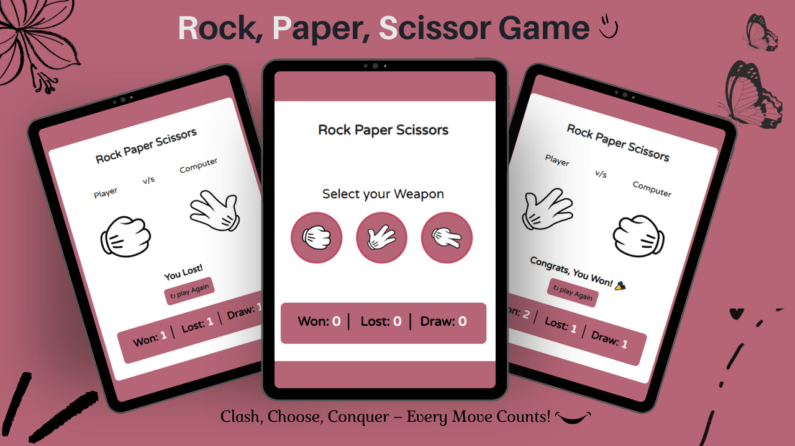

#🎮 Rock Paper Scissors Game

**📌 Overview**

This is a fun and interactive Rock Paper Scissors web game built using HTML, CSS, and JavaScript. The player selects a weapon (Rock, Paper, or Scissors) and competes against the computer. The game keeps track of wins, losses, and draws in real time.

**✨Features**

🎯 Simple and user-friendly interface

🤖 Random computer-generated choices

📊 Live score tracking (Wins, Losses, Draws)

🎬 Animated gameplay for better experience

🔄 Play again functionality

📱 Responsive design for different screen sizes

**🛠️ Technologies Used**

 HTML
 
 CSS3
 
 JavaScript

**🎮 How to Play**

Select your weapon (Rock, Paper, or Scissors)

The computer will randomly choose its weapon

The result will be displayed:

   Rock beats Scissors
   
   Paper beats Rock
   
   Scissors beats Paper
   
   Scores update automatically
   
   Click Play Again to restart
   
**OR**

Use the link below:

link : https://rocpapsci-baklava-31f32c.netlify.app/
   

**Amazing view of the game!**

